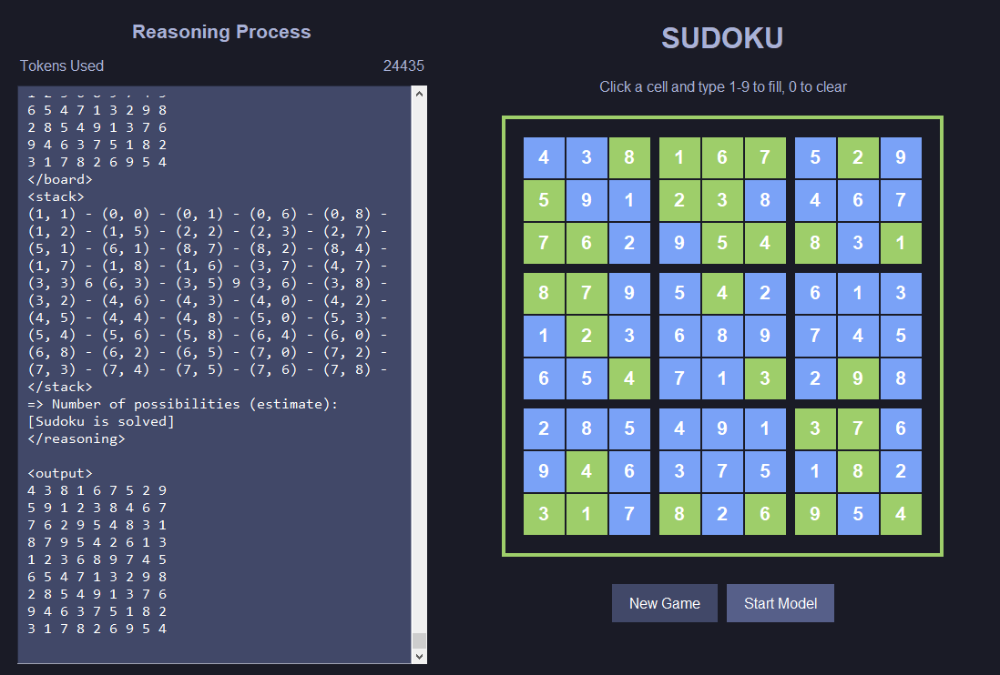
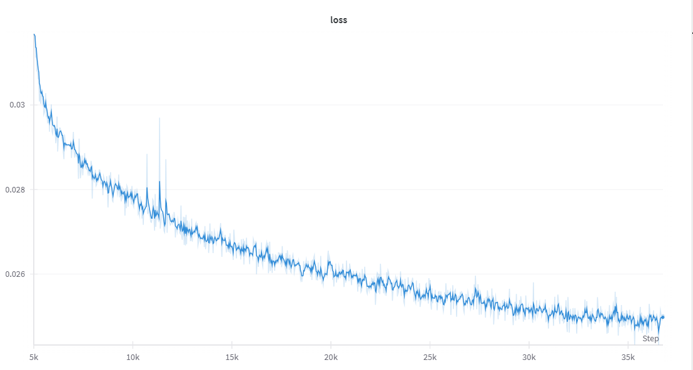
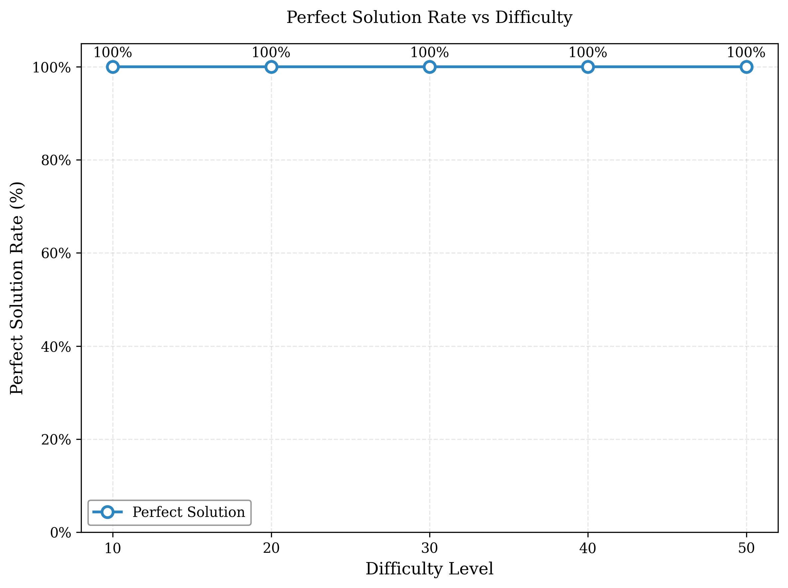
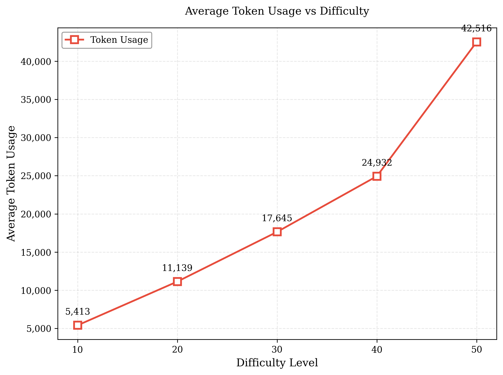

# Sudoku-RWKV

A specialized RWKV model for solving Sudoku puzzles.

## Requirements

- rwkv
- colorama

## Quick Start

- Run `launch.py` or `minimum_inference.py` to solve Sudoku puzzles
- Run `generate_sudoku_data.py` to generate training data

## Model

The current `sudoku_rwkv_20241029.pth` model is a specialized RWKV-v6 model trained on 700k Sudoku samples (~25B tokens) specifically for solving Sudoku puzzles.

Model specifications:
- Parameters: ~29M
- Vocabulary size: 140
- Architecture: 8 layers, 512 dimensions

The model includes a simple improvement for better performance (see `model.py` line 372). Corresponding modifications were made in the inference code (`rwkv_model.py` lines 852, 893-896).

## Training

The model was trained using the [RWKV-LM](https://github.com/BlinkDL/RWKV-LM) repository.

Hyperparameters:
- `M_BSZ`: 32
- `CTX_LEN`: 8192
- `LR`: 8e-4 to 3e-5
- `ADAM_EPS`: 1e-18
- `ADAM_BETA1`: 0.9
- `ADAM_BETA2`: 0.99
- `WEIGHT_DECAY`: 0.1

Loss Curve:

## Experiments

I tested the model on samples of varying difficulty levels, with results shown below:

Note: Difficulty is measured by the number of empty cells in the Sudoku puzzle

## Limitations

- Current model may struggle with extremely difficult Sudoku puzzles. I've observed occasional errors in stack state tracking.

## Future Work

- Train on a larger dataset to develop a model capable of solving any Sudoku puzzle (maybe 3x more data needed)
- Experiment with smaller model to find the minimum viable model size for solving Sudoku puzzles